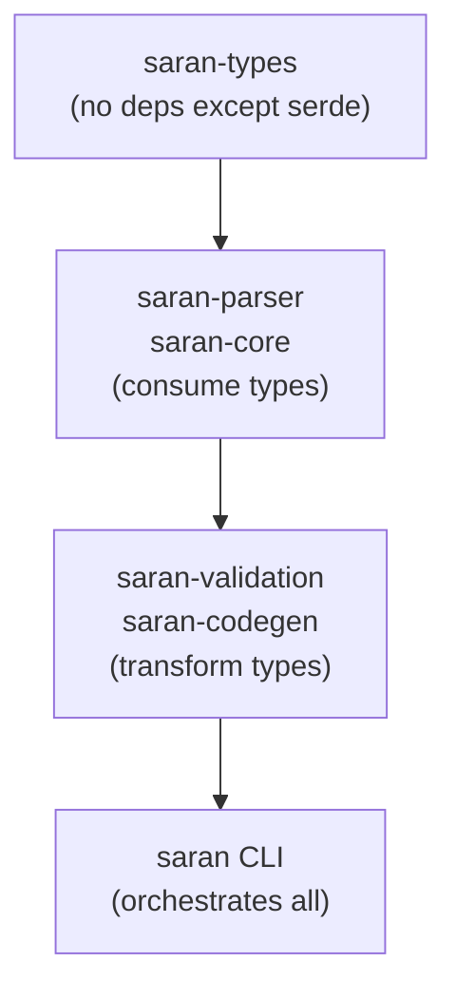

# saran-types

Core type definitions for the Saran CLI wrapper framework.

## Purpose

`saran-types` is the foundation crate providing shared data structures used across all other Saran crates. It defines the canonical Rust representations of:

- **Wrapper definitions** (`WrapperDefinition`) — the in-memory representation of a parsed YAML wrapper file
- **Commands** (`Command`) — subcommand definitions with actions and arguments
- **Actions** (`Action`) — process invocations with arguments and optional flags
- **Variables** (`VarDecl`) — environment variable declarations with resolution metadata
- **Configuration** — quotas, version requirements, and positional arguments

These types are consumed by:

- **saran-parser**: YAML → `WrapperDefinition`
- **saran-validation**: Validates `WrapperDefinition` against schema (01-05 test specs)
- **saran-codegen**: Transforms `WrapperDefinition` → Rust source code
- **saran-core**: Runtime types used in generated wrappers
- **saran CLI**: Creates and manipulates wrapper definitions

## No Implementation Logic

This crate contains **only type definitions and doc comments**. No business logic, validation, parsing, or code generation. Pure data structures with `serde` serialization support.

## Dependency Graph

