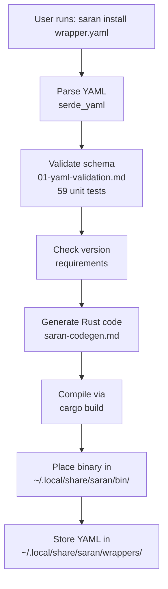
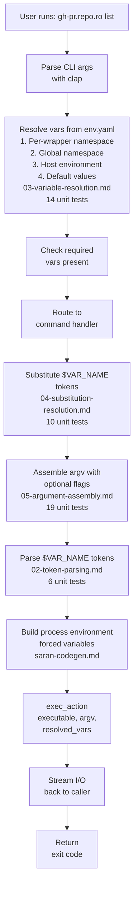
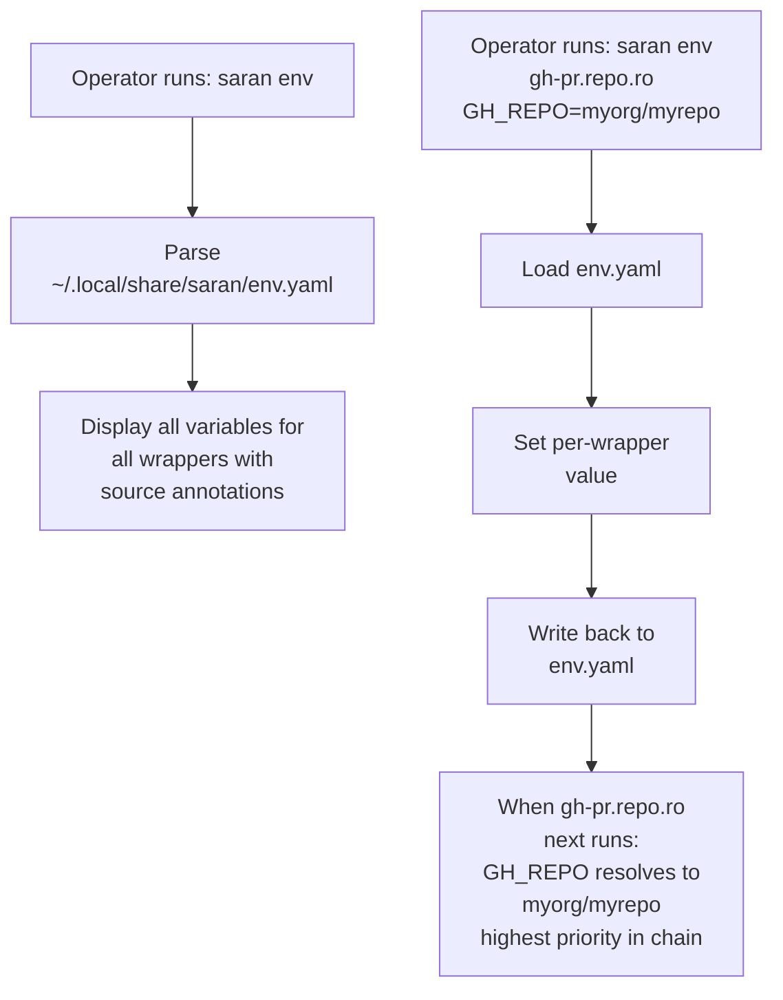
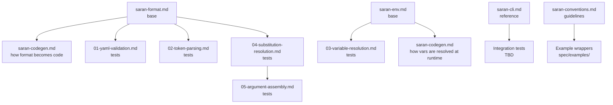
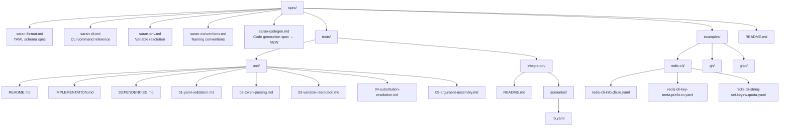

# Saran Specification Index

This document maps all Saran specifications and their relationships. Use this to understand the complete architecture and where each piece fits.

---

## Core Specifications

### Format & Behavior

| Document | Purpose | Audience | Status |
|----------|---------|----------|--------|
| **[saran-format.md](./saran-format.md)** | YAML wrapper file schema and execution model | Wrapper authors, developers | ✅ Complete |
| **[saran-cli.md](./saran-cli.md)** | User-facing CLI commands (install, remove, list, env) | End users, operators | ✅ Complete |
| **[saran-env.md](./saran-env.md)** | Environment variable resolution and configuration | Operators, developers | ✅ Complete |
| **[saran-conventions.md](./saran-conventions.md)** | Wrapper naming conventions and scoping patterns | Wrapper authors | ✅ Complete |
| **[saran-codegen.md](./saran-codegen.md)** | How YAML is transformed into executable Rust code | Developers, code reviewers | ✅ Complete (this document) |

---

## Testing Specifications

### Unit Tests (Fast, No Dependencies)

| Document | Test Count | Coverage | Status |
|----------|-----------|----------|--------|
| **[spec/tests/unit/01-yaml-validation.md](./tests/unit/01-yaml-validation.md)** | 59 | YAML schema validation, error messages | ✅ Complete |
| **[spec/tests/unit/02-token-parsing.md](./tests/unit/02-token-parsing.md)** | 6 | `$VAR_NAME` token extraction | ✅ Complete |
| **[spec/tests/unit/03-variable-resolution.md](./tests/unit/03-variable-resolution.md)** | 14 | Env.yaml priority chain resolution | ✅ Complete |
| **[spec/tests/unit/04-substitution-resolution.md](./tests/unit/04-substitution-resolution.md)** | 10 | Variable substitution in strings | ✅ Complete |
| **[spec/tests/unit/05-argument-assembly.md](./tests/unit/05-argument-assembly.md)** | 19 | Child process argv construction | ✅ Complete |
| **Code Generation** | TBD | Generated Rust code correctness | 📋 To be specified |

**Total Unit Tests: 108 (+ code generation tests)**

### Integration Tests (Slower, With Dependencies)

| Document | Scenarios | Coverage | Status |
|----------|-----------|----------|--------|
| **[spec/tests/integration/scenarios/ro.yaml](./tests/integration/scenarios/ro.yaml)** | 11 | Redis read-only wrapper execution | ✅ Complete |
| **CLI Integration** | TBD | `saran install/list/remove/env` commands | 📋 To be specified |

---

## Data Flow Map

### 1. Installation Flow



### 2. Execution Flow



### 3. Variable Configuration Flow



---

## Test Coverage Matrix

### Core Logic (Unit Tests)

| Function | Spec | Tests | Notes |
|----------|------|-------|-------|
| **Parse wrapper YAML** | saran-format.md | 01-yaml-validation | Schema validation |
| **Validate schema** | saran-format.md | 01-yaml-validation (59) | All error types |
| **Parse $VAR_NAME tokens** | saran-format.md | 02-token-parsing (6) | Greedy matching rules |
| **Resolve variables** | saran-env.md | 03-variable-resolution (14) | Priority chain |
| **Substitute tokens** | saran-format.md | 04-substitution-resolution (10) | Context-specific rules |
| **Assemble argv** | saran-format.md | 05-argument-assembly (19) | Flag appending, order |
| **Generate Rust code** | saran-codegen.md | Code Generation (TBD) | Clap integration, validity |

### Real Behavior (Integration Tests)

| Scenario | Wrapper | Coverage | Expected |
|----------|---------|----------|----------|
| **Constraint enforcement** | redis-cli-info.db.ro | Wrapper blocks undeclared commands | ✅ Only PING/INFO/DBSIZE allowed |
| **Variable injection** | redis-cli-info.db.ro | Vars pass to child process | ✅ redis-cli receives -h/-p/-n values |
| **Scope enforcement** | redis-cli-key-meta.prefix.ro | Key prefix is enforced | ✅ Cannot read outside prefix |
| **Error handling** | redis-cli-info.db.ro | Connection errors propagate | ✅ Clear error messages |
| **CLI integration** | TBD | saran install/list/remove/env | 📋 To be specified |

---

## Implementation Timeline

### Phase 1: Foundation (Week 1)
```
✅ Implement pure function tests
  - 01-yaml-validation.md (59 tests)
  - 02-token-parsing.md (6 tests)
  
→ Deliverable: Complete YAML parsing & validation
```

### Phase 2: Data Transformations (Week 2)
```
✅ Implement core logic tests
  - 03-variable-resolution.md (14 tests)
  - 04-substitution-resolution.md (10 tests)
  - 05-argument-assembly.md (19 tests)
  - Code generation tests (TBD)
  
→ Deliverable: Complete variable resolution & code generation
```

### Phase 3: Integration (Week 3)
```
✅ Wire components together
  - Integration tests with testcontainers
  - CLI command tests
  - End-to-end wrapper execution
  
→ Deliverable: Working saran binary with wrapper support
```

---

## Key Architectural Decisions

### 1. Code Generation Model (saran-codegen.md)

- ✅ Each wrapper compiles to a standalone binary
- ✅ No runtime YAML parsing or routing
- ✅ Generated code uses pinned `clap` for reliability
- ✅ Shared `saran-core` library for common utilities
- ✅ Static linking for portability

### 2. Variable Resolution Chain (saran-env.md)

Priority order (highest → lowest):
1. Per-wrapper namespace in env.yaml
2. Global namespace in env.yaml
3. Host environment
4. Default value in wrapper YAML

### 3. Process Execution Model (saran-codegen.md)

- ✅ Non-shell exec (std::process::Command)
- ✅ No metacharacter interpretation
- ✅ Forced environment (override inherited values)
- ✅ Discrete argv elements (no word splitting)

### 4. Testing Strategy

- **Unit tests**: Fast feedback, isolated logic
- **Code generation unit tests**: Validate clap integration
- **Integration tests**: Real behavior with testcontainers
- **CLI smoke tests**: Wrapper installation and management

---

## Specification Dependencies



---

## What's Ready for Implementation

✅ **Ready** (complete specifications)
- YAML format (saran-format.md)
- CLI commands (saran-cli.md)
- Variable resolution (saran-env.md)
- Naming conventions (saran-conventions.md)
- Unit test specifications (01-05)
- Code generation design (saran-codegen.md)
- Integration test scenarios (ro.yaml)

📋 **To Specify**
- Code generation unit tests (details)
- CLI integration tests (scenarios)
- Error handling taxonomy (error codes & messages)
- CLI lifecycle (step-by-step flow)

---

## Quick Reference

### For Wrapper Authors
- Read: saran-format.md, saran-conventions.md
- Reference: spec/examples/

### For Operators
- Read: saran-cli.md, saran-env.md
- Reference: saran-conventions.md (wrapper scoping)

### For Developers
- Read: saran-codegen.md (code generation)
- Read: tests/unit/*.md (behavior specification)
- Read: tests/integration/*.md (end-to-end behavior)
- Reference: IMPLEMENTATION.md (project timeline)

### For Code Reviewers
- Check: Generated code matches saran-codegen.md patterns
- Check: Unit tests cover 01-05 test specifications
- Check: Integration tests exercise real CLI behavior
- Check: Error messages match error taxonomy (TBD)

---

## Files in This Directory



---

## Next Steps

1. **Review saran-codegen.md** ← You are here
2. **Add code generation test spec** (details of what unit tests should verify)
3. **Add error handling taxonomy** (error codes and messages)
4. **Add CLI lifecycle spec** (step-by-step for install/list/remove/env)
5. **Begin Phase 1 implementation** (unit tests for parsing & validation)

Questions? Check the individual specification documents or the IMPLEMENTATION.md file.
