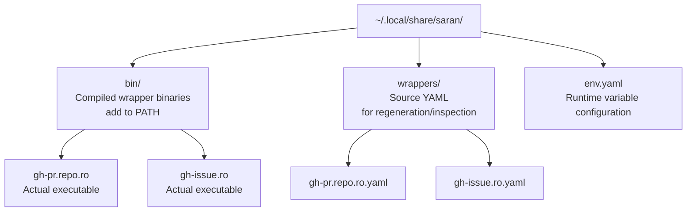

# Saran CLI Reference

## Overview

The `saran` binary is a wrapper generator and management tool. When invoked directly as `saran`, it provides subcommands for installing, removing, listing, and validating wrappers. When you install a wrapper from a YAML file, Saran compiles a standalone CLI binary that can be invoked directly by name — no routing or YAML parsing at runtime.

> **See also:** [`saran-format.md`](saran-format.md) for the wrapper YAML format, [`saran-env.md`](saran-env.md) for the `saran env` command, and `crates/saran-state/` for implementation details.

---

## Binary Generation Model

Saran uses a **code generation** model: each installed wrapper is a standalone CLI binary compiled from its YAML definition. When `saran install` registers a wrapper, it:

1. Parses and validates the YAML
2. Generates Rust source code for a `clap`-based CLI
3. Compiles it via `cargo build`
4. Places the resulting binary in `~/.local/share/saran/bin/`

This means every wrapper is a true executable with native `--help`, completions, and fast startup — no YAML parsing or routing logic at runtime.



> **PATH setup:** Add `~/.local/share/saran/bin` to your shell `PATH` to make installed wrappers directly invocable by name:
>
> ```bash
> export PATH="$HOME/.local/share/saran/bin:$PATH"
> ```

**Why compilation?** Since Saran itself is installed via `cargo`, users have Rust available. Compilation happens once at install time; every subsequent invocation is a direct binary execution with zero overhead. This also means generated wrappers get proper tooling: `which gh-pr.repo.ro` returns the real path, `--help` works natively, and shell completions can be generated.

---

## `saran install`

Installs a Saran wrapper from a local file or a remote Git repository.

### Local install

```
saran install <path-to-yaml>
```

1. Validates the YAML file against the Saran format spec
2. Reads the `name:` field from the file
3. Copies the file to `~/.local/share/saran/wrappers/<name>.yaml`
4. Generates Rust source code from the wrapper definition
5. Compiles the binary via `cargo build` and places it at `~/.local/share/saran/bin/<name>`

If a wrapper with the same name is already installed, `saran install` exits with an error. Use `--force` to overwrite (re-compiles the binary).

```bash
saran install ./gh-pr.repo.ro.yaml
saran install ./gh-pr.repo.ro.yaml --force   # overwrite existing
```

### Remote install via Git

```
saran install --git <repo-url> [<path-within-repo>]
```

Clones or fetches the specified Git repository and installs wrapper(s) from it.

```bash
# Install all .yaml files found at the repo root
saran install --git github.com/myorg/saran-wrappers

# Install a specific file within the repo
saran install --git github.com/myorg/saran-wrappers gh-pr.repo.ro.yaml

# Install from a subdirectory
saran install --git github.com/myorg/saran-wrappers wrappers/gh-pr.repo.ro.yaml
```

**URL format:** The `--git` value is a repository URL. The following formats are accepted:

| Format                     | Example                           |
| -------------------------- | --------------------------------- |
| Shorthand (GitHub assumed) | `github.com/myorg/myrepo`         |
| Full HTTPS URL             | `https://github.com/myorg/myrepo` |
| SSH URL                    | `git@github.com:myorg/myrepo.git` |

**Path argument:** If no path is specified, Saran looks for all `*.yaml` files at the repository root that are valid Saran wrapper files and installs them all. If a path is specified, only that file is installed.

**Version pinning:** An optional `@ref` suffix pins the install to a specific branch, tag, or commit SHA:

```bash
saran install --git github.com/myorg/saran-wrappers@v1.2.0
saran install --git github.com/myorg/saran-wrappers@main gh-pr.repo.ro.yaml
```

If no `@ref` is specified, the default branch HEAD is used.

**Cloning behavior:** The repository is cloned into a temporary directory, the specified file(s) are copied to `~/.local/share/saran/wrappers/`, and the clone is discarded. Saran does not retain the full repository after install.

### Flags

| Flag          | Description                                                       |
| ------------- | ----------------------------------------------------------------- |
| `--force`     | Overwrite an existing wrapper with the same name                  |
| `--git <url>` | Install from a remote Git repository                              |
| `--dry-run`   | Validate and print what would be installed without making changes |

---

## `saran remove`

Uninstalls one or more installed wrappers.

```
saran remove <name> [<name> ...]
```

For each named wrapper:

1. Removes the binary at `~/.local/share/saran/bin/<name>`
2. Removes the wrapper file at `~/.local/share/saran/wrappers/<name>.yaml`
3. Removes any per-wrapper entries for `<name>` from `~/.local/share/saran/env.yaml`

```bash
saran remove gh-pr.repo.ro
saran remove gh-pr.repo.ro gh-issue.ro   # remove multiple at once
```

If the named wrapper is not installed, `saran remove` exits with an error.

### Flags

| Flag         | Description                                                                       |
| ------------ | --------------------------------------------------------------------------------- |
| `--keep-env` | Remove the wrapper binary and YAML but preserve per-wrapper entries in `env.yaml` |
| `--dry-run`  | Print what would be removed without making changes                                |

---

## `saran list`

Lists all currently installed wrappers.

```
$ saran list

gh-pr.repo.ro  1.0.0   ~/.local/share/saran/wrappers/gh-pr.repo.ro.yaml
gh-issue.ro    1.0.0   ⚠ gh 1.8.3 (requires >=2.0.0)   ~/.local/share/saran/wrappers/gh-issue.ro.yaml
greet          0.1.0   ~/.local/share/saran/wrappers/greet.yaml
```

The version shown is read from the `version:` field in each installed wrapper's YAML file — it reflects the wrapper definition version, not the underlying CLI's version. For wrappers installed via `--git`, the `@ref` tag pins which revision of the repository is fetched, but the displayed version always comes from the `version:` field inside the wrapper file itself.

If a wrapper's `requires:` constraints are not satisfied on the current system, each failing requirement is shown inline as a soft warning. If the version probe fails entirely (CLI not found or no version string matched), the warning reads `⚠ <cli> unknown (requires <constraint>)`. Wrappers with failed requirements remain invocable; the warning is informational only.

---

## `saran validate`

Validates a wrapper YAML file against the Saran format spec without installing it.

```
saran validate <path-to-yaml>
```

Exits with code `0` if the file is valid, non-zero with a descriptive error message if not. Useful for CI or pre-install checks.

Validation includes checking all `requires:` constraints against the current system. If any version probe fails or the detected version does not satisfy the declared constraint, `saran validate` exits non-zero with a clear diagnostic:

```bash
saran validate ./gh-pr.repo.ro.yaml
# → OK: gh-pr.repo.ro v1.0.0 (6 commands, 2 vars, 1 requirement checked)

saran validate ./gh-pr.repo.ro.yaml
# → error: requires gh >=2.0.0, but found gh 1.8.3
#          Update gh or loosen the version constraint in the wrapper.

saran validate ./gh-pr.repo.ro.yaml
# → error: requires gh >=2.0.0, but version probe failed: `gh --version` exited with code 127
#          Ensure `gh` is installed and available on PATH.
```

---

## `saran quotas`

Manages quota state for quota-bounded wrappers. Quotas track how many times a quota-guarded command can be executed within a session.

### Read: `saran quotas`

Lists all quota states for all installed quota-bounded wrappers:

```
$ saran quotas

gh-pr-comment.pr.rw.quota:
  comment: 1/1 remaining

glab-mr-note.mr.rw.quota:
  note: 3/5 remaining
  resolve: 5/5 remaining
  unresolve: 5/5 remaining
```

### Read: `saran quotas <wrapper>`

Lists quota state for a single wrapper:

```
$ saran quotas gh-pr-comment.pr.rw.quota

gh-pr-comment.pr.rw.quota:
  comment: 1/1 remaining
```

### Reset: `saran quotas reset <wrapper>`

Resets all quotas for a specific wrapper to their configured limits. This is typically called at the start of a new session:

```bash
saran quotas reset gh-pr-comment.pr.rw.quota
# → Reset gh-pr-comment.pr.rw.quota: comment -> 1
```

### Reset All: `saran quotas reset-all`

Resets quotas for all quota-bounded wrappers:

```bash
saran quotas reset-all
# → Reset 3 wrappers: gh-pr-comment.pr.rw.quota, glab-mr-note.mr.rw.quota, redis-cli-string-set.key.rw.quota
```

### Flags

| Flag     | Description                                        |
| -------- | -------------------------------------------------- |
| `--json` | Output in JSON format for programmatic consumption |

---

## Data Directory

All Saran state lives under `~/.local/share/saran/` by default:

```
~/.local/share/saran/
  bin/          Compiled wrapper binaries (add to PATH)
  wrappers/     Source YAML files (for regeneration, inspection)
  env.yaml      Operator-managed variable configuration
  quotas.yaml   Quota state tracking (one file per wrapper)
```

The data directory can be overridden by setting the `SARAN_DATA_DIR` environment variable:

```bash
export SARAN_DATA_DIR=/opt/saran
```
