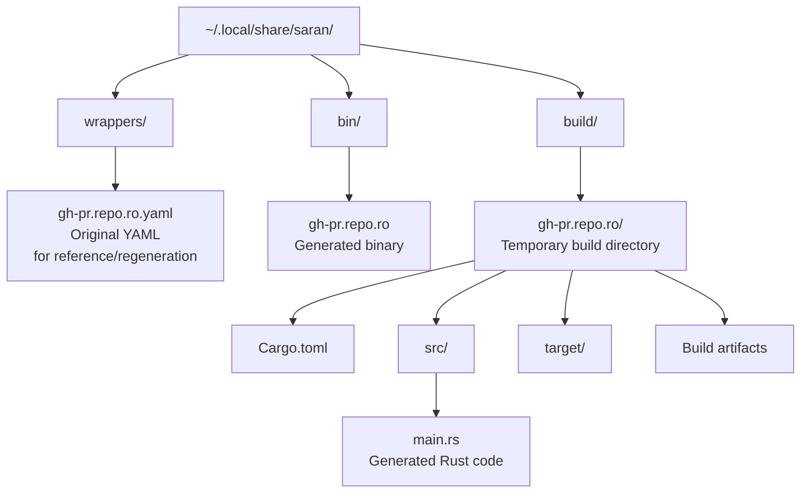

# Saran Code Generation Specification

## Overview

When `saran install wrapper.yaml` is invoked, Saran:

1. **Parses and validates** the wrapper YAML (schema validation via 01-yaml-validation.md)
2. **Generates Rust source code** for a standalone CLI binary using clap
3. **Compiles** the generated code via `cargo build`
4. **Places the binary** at `~/.local/share/saran/bin/<name>`

This document specifies **how YAML definitions are transformed into executable Rust code**.

---

## Key Principles

### 1. Direct Process Invocation (Non-Shell Exec)

Generated wrappers invoke the underlying CLI via `std::process::Command` (equivalent to `execvp`), **never through a shell**. This ensures:

- ✅ No shell metacharacter interpretation
- ✅ No word splitting or glob expansion
- ✅ Arguments passed as discrete elements
- ✅ Caller-supplied values cannot override fixed arguments

### 2. Early Variable Resolution

All `vars:` are resolved **at wrapper startup** (before user invocation), not at invocation time. This ensures:

- ✅ Clear error messages if required variables aren't set
- ✅ Variables cannot be injected by callers
- ✅ Variable values are stable across all commands

### 3. Shared Utilities Library

Generated wrappers use a shared `saran-core` library (statically linked) for:

- Variable resolution from `env.yaml`
- Environment variable layering (per-wrapper → global → host → default)
- Argument assembly and process execution
- Error reporting

This avoids code duplication across wrappers and makes updates centralized.

### 4. Enforced Environment

The child process environment is **constructed by Saran**, not inherited from the ambient shell. Resolved variables are force-set, overwriting any pre-existing values.

---

## Code Generation Architecture

### Input & Output

| Phase          | Input               | Output                                      | Responsibility                           |
| -------------- | ------------------- | ------------------------------------------- | ---------------------------------------- |
| 1. Parsing     | wrapper.yaml        | Parsed `WrapperDefinition` struct           | serde_yaml                               |
| 2. Validation  | `WrapperDefinition` | Validation errors or success                | validation crate (01-yaml-validation.md) |
| 3. Codegen     | `WrapperDefinition` | Rust source code (main.rs)                  | codegen crate (this spec)                |
| 4. Compilation | main.rs             | Binary at `~/.local/share/saran/bin/<name>` | cargo build                              |

### Generated Project Layout



---

## Shared Utilities: `saran-core` Library

The `saran-core` library (statically linked into each wrapper) provides:

### Variable Resolution

```rust
pub fn resolve_wrapper_vars(
    wrapper_name: &str,
    var_declarations: &[VarDecl],
    env_yaml_path: &Path,
) -> Result<HashMap<String, String>, SaranError> {
    // 1. Parse env.yaml
    let env_config = parse_env_yaml(env_yaml_path)?;

    // 2. For each declared variable:
    //    - Check per-wrapper namespace
    //    - Fall back to global namespace
    //    - Fall back to host environment
    //    - Fall back to default value
    //    - If required and missing → error

    let mut resolved = HashMap::new();
    let mut missing_required = Vec::new();

    for var_decl in var_declarations {
        let value = resolve_single_var(
            &var_decl,
            wrapper_name,
            &env_config,
        );

        match value {
            Some(v) => { resolved.insert(var_decl.name.clone(), v); }
            None if var_decl.required => {
                missing_required.push(var_decl.name.clone());
            }
            None => { /* Optional var, not set - skip */ }
        }
    }

    if !missing_required.is_empty() {
        return Err(SaranError::MissingRequiredVars(missing_required));
    }

    Ok(resolved)
}

fn resolve_single_var(
    var_decl: &VarDecl,
    wrapper_name: &str,
    env_config: &EnvYaml,
) -> Option<String> {
    // Priority chain (highest → lowest)

    // 1. Per-wrapper namespace
    if let Some(value) = env_config.wrappers
        .get(wrapper_name)
        .and_then(|w| w.get(&var_decl.name)) {
        return Some(value.clone());
    }

    // 2. Global namespace
    if let Some(value) = env_config.global.get(&var_decl.name) {
        return Some(value.clone());
    }

    // 3. Host environment
    if let Ok(value) = std::env::var(&var_decl.name) {
        return Some(value);
    }

    // 4. Default value
    var_decl.default.clone()
}
```

### Argument Assembly with Substitution

```rust
pub fn assemble_argv(
    action_args: &[String],
    resolved_vars: &HashMap<String, String>,
    caller_args: &HashMap<String, String>,
    optional_flags: Vec<(String, String)>, // [(flag_name, value), ...]
) -> Result<Vec<String>, SaranError> {
    let mut argv = Vec::new();

    // 1. Substitute variables in fixed arguments
    for arg in action_args {
        let substituted = substitute_vars(arg, resolved_vars, caller_args)?;
        argv.push(substituted);
    }

    // 2. Append optional flags (in declaration order)
    for (flag_name, flag_value) in optional_flags {
        argv.push(flag_name);
        argv.push(flag_value);
    }

    Ok(argv)
}

pub fn substitute_vars(
    template: &str,
    resolved_vars: &HashMap<String, String>,
    caller_args: &HashMap<String, String>,
) -> Result<String, SaranError> {
    let mut result = String::new();
    let mut chars = template.chars().peekable();

    while let Some(ch) = chars.next() {
        if ch == '$' {
            // Parse $VAR_NAME
            let var_name = parse_var_name(&mut chars)?;

            // Resolve from vars first, then caller args
            if let Some(value) = resolved_vars.get(var_name) {
                result.push_str(value);
            } else if let Some(value) = caller_args.get(var_name) {
                result.push_str(value);
            } else {
                return Err(SaranError::UndeclaredVariable(var_name.to_string()));
            }
        } else {
            result.push(ch);
        }
    }

    Ok(result)
}
```

### Process Execution with Forced Environment

```rust
pub fn exec_action(
    executable: &str,
    argv: Vec<String>,
    resolved_vars: &HashMap<String, String>,
) -> Result<std::process::ExitStatus, SaranError> {
    let mut cmd = std::process::Command::new(executable);

    // Clear inherited environment
    cmd.env_clear();

    // Copy host environment (PATH, HOME, etc.)
    for (key, value) in std::env::vars() {
        cmd.env(&key, &value);
    }

    // Force-set resolved variables (overwriting any inherited values)
    for (key, value) in resolved_vars {
        cmd.env(key, value);
    }

    // Build argv: [executable, ...user_args]
    for arg in argv {
        cmd.arg(arg);
    }

    // Execute and return exit status
    let status = cmd.status()?;
    Ok(status)
}
```

---

## Generated Code Structure

### Generated `main.rs` Pattern

For a given wrapper YAML, the generated code follows this structure:

```rust
use saran_core::{
    resolve_wrapper_vars, assemble_argv, exec_action,
    VarDecl, SaranError,
};
use clap::{Parser, Subcommand};
use std::process;

// ============================================================================
// CLI Argument Parser (generated from wrapper YAML)
// ============================================================================

#[derive(Parser)]
#[command(name = "gh-pr.ro")]
#[command(version = "1.0.0")]
#[command(about = "Read-only gh pr operations for $GH_REPO")]
#[command(author = "Generated by Saran")]
struct Cli {
    #[command(subcommand)]
    command: Commands,
}

#[derive(Subcommand)]
enum Commands {
    /// List pull requests in $GH_REPO
    List {
        /// Comma-separated fields for JSON output
        #[arg(long)]
        json: Option<String>,

        /// Filter by state (open, closed, merged, all)
        #[arg(long)]
        state: Option<String>,
    },

    /// View a pull request in $GH_REPO
    View {
        /// Pull request number or URL
        pr_ref: String,

        /// Include pull request comments
        #[arg(long)]
        comments: bool,
    },
}

// ============================================================================
// Variable Declarations (generated from wrapper vars:)
// ============================================================================

fn get_var_declarations() -> Vec<VarDecl> {
    vec![
        VarDecl {
            name: "GH_REPO".to_string(),
            required: true,
            default: None,
        },
        VarDecl {
            name: "GH_TOKEN".to_string(),
            required: true,
            default: None,
        },
    ]
}

// ============================================================================
// Main Entry Point
// ============================================================================

fn main() {
    let args = Cli::parse();

    // Step 1: Resolve variables at startup
    let var_declarations = get_var_declarations();
    let wrapper_name = "gh-pr.repo.ro";
    let env_yaml_path = std::path::Path::new(
        &format!("{}/.local/share/saran/env.yaml",
                 std::env::var("HOME").unwrap())
    );

    let resolved_vars = match resolve_wrapper_vars(
        wrapper_name,
        &var_declarations,
        env_yaml_path,
    ) {
        Ok(vars) => vars,
        Err(e) => {
            eprintln!("{}", e);
            process::exit(1);
        }
    };

    // Step 2: Route to command handler
    let exit_code = match args.command {
        Commands::List { json, state } => {
            handle_list(&resolved_vars, json, state)
        }
        Commands::View { pr_ref, comments } => {
            handle_view(&resolved_vars, &pr_ref, comments)
        }
    };

    process::exit(exit_code);
}

// ============================================================================
// Command Handlers (generated from wrapper commands:)
// ============================================================================

fn handle_list(
    resolved_vars: &HashMap<String, String>,
    json: Option<String>,
    state: Option<String>,
) -> i32 {
    // Build fixed action arguments
    let mut argv = vec![
        "pr".to_string(),
        "list".to_string(),
        "-R".to_string(),
        resolved_vars["GH_REPO"].clone(),
    ];

    // Append optional flags
    if let Some(json_fields) = json {
        argv.push("--json".to_string());
        argv.push(json_fields);
    }
    if let Some(state_val) = state {
        argv.push("--state".to_string());
        argv.push(state_val);
    }

    // Execute: gh [pr] [list] [-R org/repo] [--json ...] [--state ...]
    match exec_action("gh", argv, resolved_vars) {
        Ok(status) => status.code().unwrap_or(1),
        Err(e) => {
            eprintln!("error: {}", e);
            1
        }
    }
}

fn handle_view(
    resolved_vars: &HashMap<String, String>,
    pr_ref: &str,
    comments: bool,
) -> i32 {
    // Substitute $PR_REF with caller-supplied value
    let caller_args = maplit::hashmap! {
        "PR_REF" => pr_ref,
    };

    // Build fixed action arguments with substitution
    let mut action_template = vec![
        "pr".to_string(),
        "view".to_string(),
        "$PR_REF".to_string(),
        "-R".to_string(),
        resolved_vars["GH_REPO"].clone(),
    ];

    // Perform substitution
    let argv = action_template
        .iter()
        .map(|arg| substitute_vars(arg, resolved_vars, &caller_args))
        .collect::<Result<Vec<_>, _>>()
        .unwrap_or_else(|e| {
            eprintln!("error: {}", e);
            process::exit(1);
        });

    // Append optional flags
    if comments {
        argv.push("--comments".to_string());
    }

    // Execute: gh [pr] [view] [<pr_ref>] [-R org/repo] [--comments]
    match exec_action("gh", argv, resolved_vars) {
        Ok(status) => status.code().unwrap_or(1),
        Err(e) => {
            eprintln!("error: {}", e);
            1
        }
    }
}
```

---

## Example: Redis Read-Only Wrapper

### Input YAML: `redis-cli-info.db.ro.yaml`

```yaml
name: redis-cli-info.db.ro
version: "1.0.0"
help: "Read-only redis-cli database inspection commands for $REDIS_HOST:$REDIS_PORT db $REDIS_DB"

requires:
  - cli: redis-cli
    version: ">=6.0.0"

vars:
  - name: REDISCLI_AUTH
    required: true
    help: "Redis password"
  - name: REDIS_HOST
    required: true
    help: "Target Redis hostname"
  - name: REDIS_PORT
    required: true
    help: "Target Redis TCP port"
  - name: REDIS_DB
    required: true
    help: "Target Redis database number"

commands:
  ping:
    help: "Ping Redis at $REDIS_HOST:$REDIS_PORT db $REDIS_DB"
    actions:
      - redis-cli: [-h, "$REDIS_HOST", -p, "$REDIS_PORT", -n, "$REDIS_DB", PING]

  dbsize:
    help: "Show DBSIZE for $REDIS_HOST:$REDIS_PORT db $REDIS_DB"
    actions:
      - redis-cli:
          [-h, "$REDIS_HOST", -p, "$REDIS_PORT", -n, "$REDIS_DB", DBSIZE]
```

### Generated `main.rs` (Excerpt)

```rust
use saran_core::*;
use clap::{Parser, Subcommand};
use std::collections::HashMap;
use std::process;

#[derive(Parser)]
#[command(name = "redis-cli-info.db.ro")]
#[command(version = "1.0.0")]
#[command(about = "Read-only redis-cli database inspection commands for $REDIS_HOST:$REDIS_PORT db $REDIS_DB")]
struct Cli {
    #[command(subcommand)]
    command: Commands,
}

#[derive(Subcommand)]
enum Commands {
    /// Ping Redis at $REDIS_HOST:$REDIS_PORT db $REDIS_DB
    Ping,

    /// Show DBSIZE for $REDIS_HOST:$REDIS_PORT db $REDIS_DB
    Dbsize,
}

fn get_var_declarations() -> Vec<VarDecl> {
    vec![
        VarDecl { name: "REDISCLI_AUTH".to_string(), required: true, default: None },
        VarDecl { name: "REDIS_HOST".to_string(), required: true, default: None },
        VarDecl { name: "REDIS_PORT".to_string(), required: true, default: None },
        VarDecl { name: "REDIS_DB".to_string(), required: true, default: None },
    ]
}

fn main() {
    let args = Cli::parse();

    let resolved_vars = match resolve_wrapper_vars(
        "redis-cli-info.db.ro",
        &get_var_declarations(),
        &std::path::PathBuf::from(
            format!("{}/.local/share/saran/env.yaml", std::env::var("HOME").unwrap())
        ),
    ) {
        Ok(vars) => vars,
        Err(e) => {
            eprintln!("{}", e);
            process::exit(1);
        }
    };

    let exit_code = match args.command {
        Commands::Ping => handle_ping(&resolved_vars),
        Commands::Dbsize => handle_dbsize(&resolved_vars),
    };

    process::exit(exit_code);
}

fn handle_ping(resolved_vars: &HashMap<String, String>) -> i32 {
    let argv = vec![
        "-h".to_string(),
        resolved_vars["REDIS_HOST"].clone(),
        "-p".to_string(),
        resolved_vars["REDIS_PORT"].clone(),
        "-n".to_string(),
        resolved_vars["REDIS_DB"].clone(),
        "PING".to_string(),
    ];

    match exec_action("redis-cli", argv, resolved_vars) {
        Ok(status) => status.code().unwrap_or(1),
        Err(e) => {
            eprintln!("error: {}", e);
            1
        }
    }
}

fn handle_dbsize(resolved_vars: &HashMap<String, String>) -> i32 {
    let argv = vec![
        "-h".to_string(),
        resolved_vars["REDIS_HOST"].clone(),
        "-p".to_string(),
        resolved_vars["REDIS_PORT"].clone(),
        "-n".to_string(),
        resolved_vars["REDIS_DB"].clone(),
        "DBSIZE".to_string(),
    ];

    match exec_action("redis-cli", argv, resolved_vars) {
        Ok(status) => status.code().unwrap_or(1),
        Err(e) => {
            eprintln!("error: {}", e);
            1
        }
    }
}
```

### Runtime Flow

```
$ export REDIS_HOST=localhost REDIS_PORT=6379 REDIS_DB=0 REDISCLI_AUTH=password
$ redis-cli-info.db.ro ping

1. [Startup] Parse CLI args with clap
   → Command::Ping

2. [Startup] Resolve variables from env.yaml
   → REDIS_HOST: localhost (from host env)
   → REDIS_PORT: 6379 (from host env)
   → REDIS_DB: 0 (from host env)
   → REDISCLI_AUTH: password (from host env)

3. [Invocation] Route to handler
   → handle_ping(&resolved_vars)

4. [Assembly] Build argv
   → [-h, localhost, -p, 6379, -n, 0, PING]

5. [Execution] exec_action("redis-cli", argv, resolved_vars)
   → Construct environment: clear → inherit host → force-set resolved vars
   → exec: redis-cli -h localhost -p 6379 -n 0 PING

6. [Output] Stream redis-cli output to stdout/stderr
   → PONG

7. [Exit] Return redis-cli's exit code to caller
```

---

## Generation Algorithm

### Phase 1: Parse YAML

```rust
let wrapper_def: WrapperDefinition = serde_yaml::from_str(&yaml_content)?;
```

### Phase 2: Validate

```rust
validate_wrapper(&wrapper_def)?;  // Comprehensive schema checks
```

### Phase 3: Generate Rust Code

```rust
let generated_rs = codegen::generate(&wrapper_def)?;
// Returns complete main.rs source code as String
```

**Codegen Responsibilities:**

1. **CLI Structure**: Generate clap `Cli` struct with all commands as variants
2. **Subcommands**: For each `commands:` entry:
   - Create enum variant
   - Add args as clap attributes
   - Add optional_flags as clap options
3. **Variable Declaration**: Generate `get_var_declarations()` function
4. **Handlers**: Generate one handler function per command
5. **argv Assembly**: For each action, generate code to:
   - Substitute `$VAR_NAME` tokens
   - Append optional flags
   - Call `exec_action()`

### Phase 4: Compile

```rust
// Create temporary Cargo project
let temp_dir = create_temp_dir()?;
write_cargo_toml(&temp_dir, &wrapper_def)?;
write_generated_main_rs(&temp_dir, &generated_rs)?;

// Compile
let output = Command::new("cargo")
    .args(&["build", "--release"])
    .current_dir(&temp_dir)
    .output()?;

if !output.status.success() {
    return Err(SaranError::CompilationFailed(String::from_utf8(output.stderr)?));
}

// Move binary
let binary_src = temp_dir.join("target/release").join(&wrapper_def.name);
let binary_dst = saran_bin_dir()?.join(&wrapper_def.name);
std::fs::rename(binary_src, binary_dst)?;
```

---

## Generated `Cargo.toml`

Each generated wrapper compiles as a standalone binary:

```toml
[package]
name = "gh-pr.repo.ro"
version = "1.0.0"
edition = "2021"
publish = false

[dependencies]
clap = { version = "4.4", features = ["derive"] }
serde_yaml = "0.9"
saran-core = { path = "../../saran-core", version = "0.1" }

[[bin]]
name = "gh-pr.repo.ro"
path = "src/main.rs"

[profile.release]
opt-level = 3
lto = true
strip = true
```

**Note**: `saran-core` is always at the same pinned version as Saran itself, ensuring consistency.

---

## Environment Resolution at Runtime

### Resolving `env.yaml`

When a generated wrapper starts, it reads `~/.local/share/saran/env.yaml`:

```yaml
global:
  GH_DEBUG: "1"
  REDIS_HOST: "redis.example.com"

wrappers:
  gh-pr.repo.ro:
    GH_REPO: "myorg/myrepo"
    GH_TOKEN: "ghp_xxxxx"

  redis-cli-info.db.ro:
    REDIS_HOST: "localhost"
    REDIS_PORT: "6379"
```

**Priority for `GH_REPO` in `gh-pr.repo.ro`:**

1. Check per-wrapper: `env.yaml.wrappers["gh-pr.repo.ro"]["GH_REPO"]` → "myorg/myrepo" ✅
2. (Not reached—value found)

**Priority for `GH_DEBUG` in `gh-pr.repo.ro`:**

1. Check per-wrapper: `env.yaml.wrappers["gh-pr.repo.ro"]["GH_DEBUG"]` → (not found)
2. Check global: `env.yaml.global["GH_DEBUG"]` → "1" ✅
3. (Not reached—value found)

**Priority for `GH_TOKEN` in `gh-pr.repo.ro`:**

1. Check per-wrapper: `env.yaml.wrappers["gh-pr.repo.ro"]["GH_TOKEN"]` → "ghp_xxxxx" ✅
2. (Not reached—value found)

**Priority for `REDIS_PORT` in `redis-cli-info.db.ro`:**

1. Check per-wrapper: `env.yaml.wrappers["redis-cli-info.db.ro"]["REDIS_PORT"]` → "6379" ✅
2. (Not reached—value found)

---

## Process Execution: Forced Environment

### The Problem We Solve

Without forcing the environment, a user could do:

```bash
$ PATH=/evil/bin:/usr/bin gh-pr.repo.ro list
```

If `gh-pr.repo.ro` doesn't explicitly set PATH, the child process might find `/evil/bin/gh` instead of `/usr/bin/gh`.

### The Solution

Generated code calls:

```rust
fn exec_action(
    executable: &str,
    argv: Vec<String>,
    resolved_vars: &HashMap<String, String>,
) -> Result<ExitStatus, SaranError> {
    let mut cmd = std::process::Command::new(executable);

    // 1. Clear inherited environment
    cmd.env_clear();

    // 2. Re-inherit safe values from host
    for key in SAFE_ENV_VARS {  // PATH, HOME, LANG, TZ, etc.
        if let Ok(val) = std::env::var(key) {
            cmd.env(key, val);
        }
    }

    // 3. Force-set resolved variables (overwriting any inherited values)
    for (key, val) in resolved_vars {
        cmd.env(key, val);
    }

    // 4. Execute via execvp
    cmd.args(&argv).status()
}
```

This ensures:

- ✅ `REDISCLI_AUTH` is set to the resolved value, even if caller exported `REDISCLI_AUTH=evil`
- ✅ `REDIS_HOST` is set to the resolved value
- ✅ `PATH` is inherited from host (safe, user-controlled)
- ✅ Child process cannot override wrapper-enforced variables

---

## Validation of Generated Code

### What's Unit-Tested

The `saran::codegen` module is unit-tested to verify:

1. **Syntax correctness**: Generated Rust parses without errors
2. **clap integration**: `#[derive(Parser)]` and subcommands are valid
3. **Variable substitution**: `$VAR_NAME` patterns are correctly generated
4. **argv assembly**: Optional flags are correctly appended
5. **Error handling**: Missing required variables produce proper errors

**Example unit test:**

```rust
#[test]
fn test_codegen_required_var() {
    let yaml = r#"
    name: test
    version: "1.0.0"
    vars:
      - name: REQUIRED_VAR
        required: true
    commands:
      run:
        actions:
          - echo: ["$REQUIRED_VAR"]
    "#;

    let wrapper = parse_wrapper(yaml).unwrap();
    let generated = codegen::generate(&wrapper).unwrap();

    // Assert generated code includes variable resolution
    assert!(generated.contains("resolve_wrapper_vars"));

    // Assert generated code checks for missing required vars
    assert!(generated.contains("required: true"));

    // Assert generated code has error handling
    assert!(generated.contains("process::exit(1)"));
}

#[test]
fn test_codegen_substitution() {
    let yaml = r#"
    name: test
    version: "1.0.0"
    vars:
      - name: REPO
        required: true
    commands:
      list:
        actions:
          - gh: [pr, list, -R, "$REPO"]
    "#;

    let wrapper = parse_wrapper(yaml).unwrap();
    let generated = codegen::generate(&wrapper).unwrap();

    // Assert generated code performs substitution
    assert!(generated.contains("substitute_vars"));

    // Assert argv is correctly assembled
    assert!(generated.contains("-R"));
    assert!(generated.contains("$REPO"));
}
```

### What's Not Unit-Tested

- Generated binary execution (covered by integration tests)
- Real `env.yaml` resolution (covered by integration tests)
- Actual CLI behavior against real upstream tools (covered by integration tests)

---

## Error Handling in Generated Code

### Startup Errors (Before Commands Run)

```rust
fn main() {
    // ...
    let resolved_vars = match resolve_wrapper_vars(...) {
        Ok(vars) => vars,
        Err(e) => {
            eprintln!("{}", format_error(&e));
            process::exit(1);
        }
    };
    // ...
}
```

**Error message for missing required var:**

```
error: required variable `GH_TOKEN` is not set.
       Set it in your host environment or via: saran env gh-pr.repo.ro GH_TOKEN=<value>
       Note: storing secrets in saran env is not recommended — use your host environment instead.
```

### Invocation Errors (When Command Runs)

```rust
fn handle_list(...) -> i32 {
    match exec_action("gh", argv, resolved_vars) {
        Ok(status) => status.code().unwrap_or(1),
        Err(e) => {
            eprintln!("error: {}", e);
            1
        }
    }
}
```

---

## Binary Size & Performance

### Target Constraints

- **Binary size**: < 10MB (static linking with clap and serde_yaml)
- **Startup time**: < 500ms (parse clap args + resolve vars)
- **Execution**: < 1s overhead (wrapper setup + child invocation)

### Optimization Strategies

1. **Linking**: Use `cargo build --release` with LTO enabled
2. **Stripping**: Strip debug symbols from release binary
3. **Minimal dependencies**: Only import `clap`, `serde_yaml`, `saran-core`
4. **Lazy initialization**: Don't parse env.yaml until needed

---

## Future Extensions

### Multi-Action Support

If a command has multiple actions:

```yaml
commands:
  deploy:
    actions:
      - git: [pull, origin, main]
      - cargo: [build, --release]
      - ./deploy.sh: []
```

Generated code would:

1. Execute first action
2. If exit code == 0, proceed to second action
3. If any action fails, halt and return that exit code

### Optional Flags with Substitution

Future spec: allow `$VAR_NAME` in optional flag values (not in v1).

### Quota Enforcement

If the wrapper declares a `quotas:` block, the generated code checks per-wrapper quota state before executing quota-guarded write commands. Quota state is stored in `~/.local/share/saran/quotas.yaml` and tracks remaining operations per wrapper/command combination.

---

## Summary

Code generation is the bridge between YAML specifications and executable binaries. Generated wrappers:

1. **Parse user arguments** using clap (type-safe, validated)
2. **Resolve variables** from env.yaml (layered priority chain)
3. **Check required variables** at startup (fail early, clear errors)
4. **Assemble argv** with substitution (discrete arguments, no shell)
5. **Force environment** (override inherited values)
6. **Execute** via `std::process::Command` (non-shell exec)
7. **Stream I/O** directly to caller (transparent output)
8. **Return exit code** unchanged (true exit status)

The generated code is **unit-tested for correctness** (syntax, clap integration, substitution logic) and **integration-tested for behavior** (against real upstream tools).
