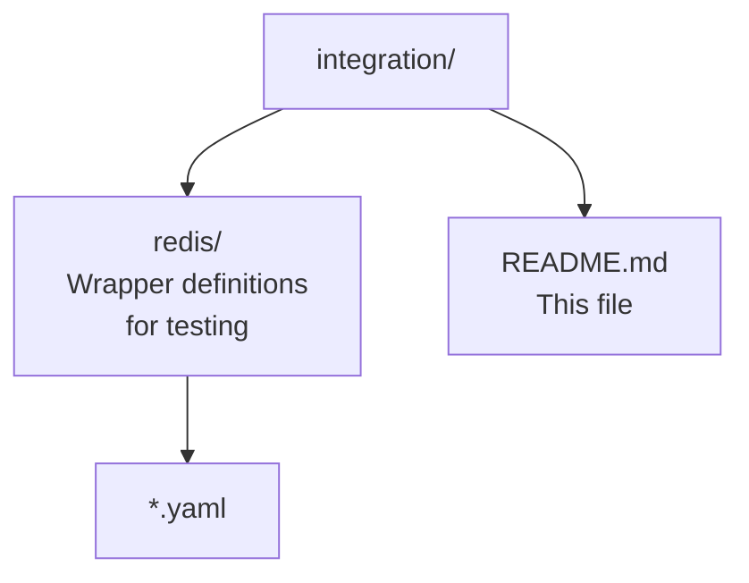

# Saran Integration Test Suite

Integration tests verify that saran wrappers work correctly with real external tools in isolated containerized environments.

## Why Redis?

Redis is ideal for integration testing:

- **Lightweight**: ~30MB, starts in < 1 second
- **Simple**: Predictable CLI behavior, no complex APIs
- **Safe**: State resets easily between tests
- **Realistic**: Tests actual CLI execution and constraint enforcement

## Approach

1. **Container Setup**: Spin up Redis container per test suite with testcontainers
2. **Wrapper Loading**: Load pre-defined wrapper YAML files into test environment
3. **Execution**: Invoke wrapper commands via saran CLI with test variables
4. **Verification**: Assert expected behavior (command success/failure, output, errors)
5. **Cleanup**: Stop container, reset state between tests

## What Gets Tested

### Constraint Enforcement
Wrappers should only expose intended operations:
- Read-only wrappers block write operations (DEL, FLUSHDB, etc.)
- Write-limited wrappers expose only approved operations
- Users cannot invoke undeclared commands

### Variable Injection
Environment variables inject correctly into CLI commands:
- `REDIS_HOST`, `REDIS_PORT` pass through to redis-cli
- Missing required variables produce clear startup errors

### Error Handling
Wrappers handle failures gracefully:
- Connection failures return descriptive errors
- Invalid inputs are rejected before CLI execution

## Test Structure

Integration tests are slower than unit tests but provide confidence that wrappers work correctly with real tools.