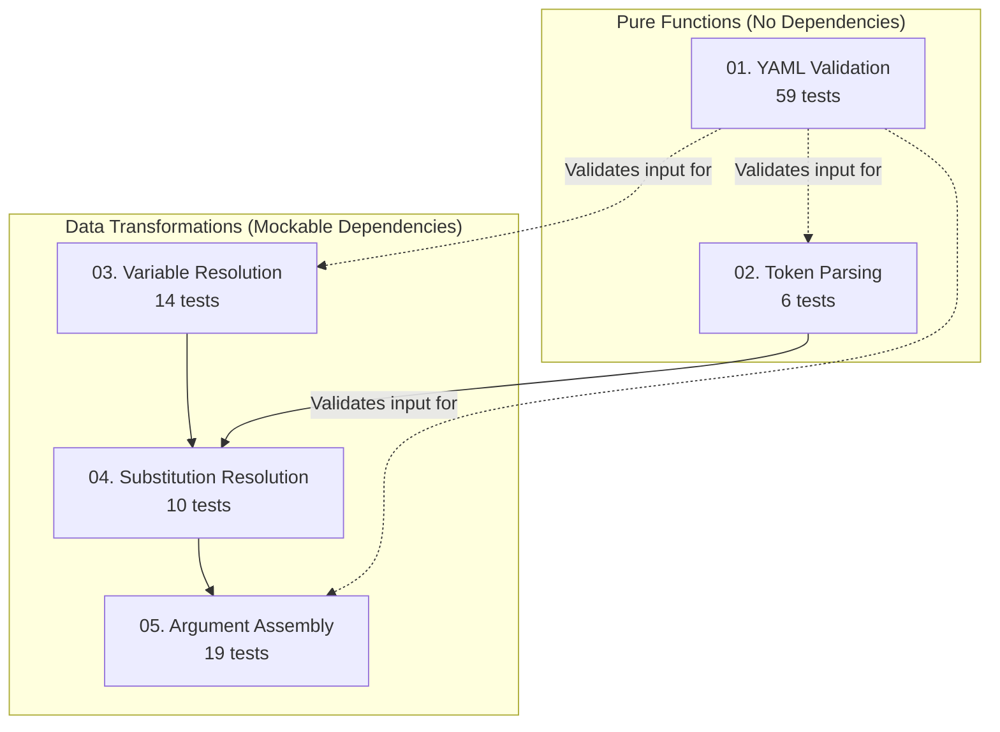

# Saran Dependency Analysis

## Dependency Graph



## Detailed Dependencies

### 01. YAML Validation (59 tests)

- **Dependencies**: None (pure function)
- **Input**: Parsed YAML structure
- **Output**: Validation errors or success
- **Testability**: ✅ Immediate - no mocks needed

### 02. Token Parsing (6 tests)

- **Dependencies**: None (pure function)
- **Input**: Strings containing `$VAR_NAME` tokens
- **Output**: Parsed tokens with positions
- **Testability**: ✅ Immediate - no mocks needed

### 03. Variable Resolution (14 tests)

- **Dependencies**: Mock parsed env.yaml
- **Input**: Variable declarations + parsed env.yaml
- **Output**: Resolved variables with values and scopes
- **Mock Requirements**:
  - Parsed env.yaml structure (global/wrappers sections)
  - Variable declarations (names, required flags, defaults)

### 04. Substitution Resolution (10 tests)

- **Dependencies**: Mock tokens + mock variable values
- **Input**: Parsed tokens + resolved variables + caller args
- **Output**: Strings with tokens replaced by values
- **Mock Requirements**:
  - Token parsing output (from 02)
  - Resolved variables (from 03)
  - Caller arguments (HashMap)

### 05. Argument Assembly (19 tests)

- **Dependencies**: Mock substituted args + mock flag values
- **Input**: Substituted action arrays + optional flag values
- **Output**: Child process argv arrays
- **Mock Requirements**:
  - Substituted action arrays (from 04)
  - Optional flag definitions and values

## Implementation Implications

### Parallel Development Possible

- **Team A**: YAML Validation (01) + Token Parsing (02)
- **Team B**: Variable Resolution (03)
- **Team C**: Substitution Resolution (04) + Argument Assembly (05)

### Mock Strategy

```rust
// Example: Testing variable resolution with mocked env.yaml
#[test]
fn test_variable_resolution() {
    // Mock parsed env.yaml
    let mock_env_yaml = ParsedEnvYaml {
        global: HashMap::from([("GH_TOKEN", "global-token")]),
        wrappers: HashMap::from([("gh-pr.repo.ro", HashMap::from([("GH_REPO", "org/repo")]))]),
    };

    // Mock variable declarations
    let var_decls = vec![
        SaranVarDecl { name: "GH_REPO", required: false, default: Some("default/repo") },
        SaranVarDecl { name: "GH_TOKEN", required: true, default: None },
    ];

    // Test resolution
    let result = resolve_vars(&var_decls, &mock_env_yaml, "gh-pr.repo.ro");
    assert_eq!(result["GH_REPO"].value, "org/repo");
    assert_eq!(result["GH_TOKEN"].value, "global-token");
}
```

### Integration Points

1. **Startup Flow**: Parse → Validate → Resolve
2. **Invocation Flow**: Parse caller args → Substitute → Assemble → Execute
3. **Error Propagation**: Validation → Resolution → Execution errors

## Risk Assessment

| Component           | Risk                    | Mitigation                 |
| ------------------- | ----------------------- | -------------------------- |
| YAML Validation     | Medium (complex schema) | Incremental implementation |
| Variable Resolution | Low (simple lookup)     | Test each priority layer   |
| Token Parsing       | Low (regex)             | Comprehensive edge cases   |
| Substitution        | Medium (context rules)  | Clear mock boundaries      |
| Argument Assembly   | Medium (flag rules)     | Type-driven implementation |

## Success Criteria

### Phase 1 Success (Pure Functions)

- [ ] All 65 pure function tests pass (01 + 02)
- [ ] No dependencies between test suites

### Phase 2 Success (Data Transformations)

- [ ] All 43 transformation tests pass with mocks (03 + 04 + 05)
- [ ] Clear mock interfaces defined

### Phase 3 Success (Integration)

- [ ] All components wire together correctly
- [ ] End-to-end tests pass with real dependencies
