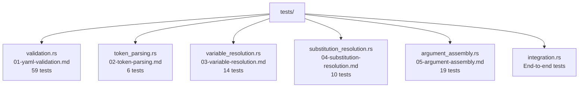

# Saran Implementation Plan

## 3-Week Implementation Timeline

### Week 1: Foundation (Pure Functions)

**Goal**: Implement all pure functions with no dependencies.

| Day | Task                             | Tests         | Deliverable                  |
| --- | -------------------------------- | ------------- | ---------------------------- |
| 1   | Project setup & YAML library     | -             | Cargo.toml, basic structure  |
| 2   | YAML parsing types               | -             | Structs for wrapper/env.yaml |
| 3   | YAML validation logic            | 59 tests (01) | Schema validation working    |
| 4   | Token parsing implementation     | 6 tests (02)  | Token extraction working     |
| 5   | Optional flag rules (part of 05) | -             | Flag→argv transformation     |

**Week 1 Success Criteria**:

- [ ] All 65 pure function tests pass (01 + 02)
- [ ] Example YAML files can be parsed and validated
- [ ] `$VAR_NAME` tokens can be extracted from strings

### Week 2: Data Transformations (Mocked Dependencies)

**Goal**: Implement functions that transform data (use mocked inputs).

| Day | Task                          | Tests         | Mock Requirements              |
| --- | ----------------------------- | ------------- | ------------------------------ |
| 6   | Variable resolution types     | -             | Structs for resolved vars      |
| 7   | Variable resolution logic     | 14 tests (03) | Mock parsed env.yaml           |
| 8   | Substitution resolution types | -             | Structs for resolution context |
| 9   | Substitution resolution logic | 10 tests (04) | Mock tokens + values           |
| 10  | Argument assembly completion  | 19 tests (05) | Mock substituted args + flags  |

**Week 2 Success Criteria**:

- [ ] All 43 transformation tests pass with mocks (03 + 04 + 05)
- [ ] Variables can be resolved from mocked env.yaml
- [ ] Tokens can be substituted with mocked values
- [ ] argv can be assembled from mocked components

### Week 3: Integration (Real Dependencies)

**Goal**: Wire components together with real dependencies.

| Day | Task                        | Focus                        | Integration Points                  |
| --- | --------------------------- | ---------------------------- | ----------------------------------- |
| 11  | Startup flow integration    | Parse → Validate → Resolve   | YAML → Validation → Resolution      |
| 12  | Invocation flow integration | Args → Substitute → Assemble | clap → Substitution → Assembly      |
| 13  | Process execution           | execvp with forced env       | Assembly → Process execution        |
| 14  | Error handling              | Propagate errors             | Validation → Resolution → Execution |
| 15  | End-to-end testing          | Full wrapper execution       | All components together             |

**Week 3 Success Criteria**:

- [ ] Example wrapper can be parsed, validated, and executed
- [ ] Variables resolve from real env.yaml file
- [ ] Simple command executes end-to-end
- [ ] All integration tests pass

## Technical Decisions

### 1. YAML Library: `serde_yaml`

- **Why**: Better error messages, serde integration
- **Alternative**: `yaml-rust` (pure Rust but less mature)
- **Decision**: `serde_yaml` for compatibility with clap

### 2. Token Parsing: Regex

- **Pattern**: `\$([A-Za-z_][A-Za-z0-9_]*)`
- **Why**: Clear expression of requirements
- **Alternative**: Manual scanning (more complex)

### 3. Variable Storage: Typed Structs

```rust
struct SaranEnvVar {
    value: String,
    scope: SaranEnvScope, // PerWrapper, Global, Host, Default
}

struct SaranEnv {
    vars: HashMap<String, SaranEnvVar>,
    missing_required: Vec<String>,
}
```

### 4. Error Handling: `thiserror` Crate

- **Why**: Structured error types with context
- **Benefits**: Clear error taxonomy for users and LLM agents

## File Structure (Implementation)

```mermaid
graph TD
    A["src/"]
    B["lib.rs"]
    C["validation/"]
    D["mod.rs<br/>YAML validation 01"]
    E["schema.rs<br/>Validation rules"]
    F["error.rs<br/>Validation errors"]

    G["parsing/"]
    H["mod.rs<br/>Token parsing 02"]
    I["tokens.rs<br/>Token types"]
    J["parser.rs<br/>Token parser"]

    K["resolution/"]
    L["mod.rs<br/>Variable resolution 03"]
    M["env.rs<br/>env.yaml parsing"]
    N["priority.rs<br/>Priority chain logic"]

    O["substitution/"]
    P["mod.rs<br/>Substitution resolution 04"]
    Q["resolver.rs<br/>Value resolver"]
    R["context.rs<br/>Resolution context"]

    S["assembly/"]
    T["mod.rs<br/>Argument assembly 05"]
    U["argv.rs<br/>argv builder"]
    V["flags.rs<br/>Flag handling"]

    W["integration/"]
    X["mod.rs<br/>Integration tests"]
    Y["startup.rs<br/>Startup flow"]
    Z["invocation.rs<br/>Invocation flow"]

    A --> B
    A --> C
    A --> G
    A --> K
    A --> O
    A --> S
    A --> W

    C --> D
    C --> E
    C --> F

    G --> H
    G --> I
    G --> J

    K --> L
    K --> M
    K --> N

    O --> P
    O --> Q
    O --> R

    S --> T
    S --> U
    S --> V

    W --> X
    W --> Y
    W --> Z
```



## Test Structure



## Risk Mitigation

### High Risk Areas

1. **YAML Schema Complexity**

   - **Mitigation**: Implement validation incrementally
   - **Fallback**: Use `serde`'s built-in validation

2. **Variable Resolution Edge Cases**

   - **Mitigation**: Test each priority layer independently
   - **Fallback**: Simple override semantics

3. **Process Execution Safety**
   - **Mitigation**: Use Rust's `std::process::Command`
   - **Fallback**: Validate executable paths before execution

### Contingency Plans

- **Week 1 slips**: Focus on core validation, defer edge cases
- **Week 2 slips**: Implement minimal mocks, expand later
- **Week 3 slips**: Basic integration first, polish later

## Success Metrics

### Quantitative

- [ ] 108 unit tests passing
- [ ] 0 compilation warnings
- [ ] < 100ms for simple wrapper execution
- [ ] < 5MB binary size

### Qualitative

- [ ] Clear error messages for malformed wrappers
- [ ] Descriptive help text for generated CLI
- [ ] Easy debugging of variable resolution
- [ ] Transparent process execution

## Getting Started

```bash
# Day 1: Project setup
cargo new saran
cd saran
cargo add serde serde_yaml thiserror anyhow
cargo add clap --features derive

# Day 2: Create module structure
mkdir -p src/{validation,parsing,resolution,substitution,assembly,integration}
touch src/{validation,parsing,resolution,substitution,assembly,integration}/mod.rs

# Day 3: Start with validation tests
cp spec/tests/unit/01-yaml-validation.md tests/validation.rs
# Implement validation to make tests pass
```

Follow the 3-week plan, checking off tasks as you complete them. Focus on **test-driven development**: write tests first, then implement functionality.
