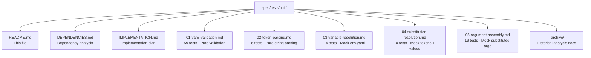

# Saran Unit Test Specifications

## Overview

This directory contains **108 unit test specifications** for Saran, organized for **test-driven development (TDD)**. Each test suite focuses on a single domain with clear dependencies.

## Test Suites

| Suite | Tests | Scope | Dependencies |
|-------|-------|-------|--------------|
| **[01-yaml-validation.md](./01-yaml-validation.md)** | 59 | Static schema validation of wrapper YAML files | None (pure validation) |
| **[02-token-parsing.md](./02-token-parsing.md)** | 6 | Pure parsing of `$VAR_NAME` tokens from strings | None (pure string ops) |
| **[03-variable-resolution.md](./03-variable-resolution.md)** | 14 | Runtime variable resolution chain (per-wrapper → global → host → default) | Mock parsed env.yaml |
| **[04-substitution-resolution.md](./04-substitution-resolution.md)** | 10 | Resolving tokens to values (vars + args) | Mock tokens + variable values |
| **[05-argument-assembly.md](./05-argument-assembly.md)** | 19 | Construction of child process `argv` from actions, vars, args, and flags | Mock substituted args + flags |

**Total: 108 unit tests**

## Implementation Strategy

### Phase 1: Pure Functions (Week 1)
```bash
# These can be implemented and tested in parallel
cargo test --test yaml_validation     # 59 tests
cargo test --test token_parsing       # 6 tests
```

### Phase 2: Data Transformations (Week 2)
```bash
# Test with mocked dependencies
cargo test --test variable_resolution  # 14 tests (mock env.yaml)
cargo test --test substitution_resolution # 10 tests (mock tokens + values)
cargo test --test argument_assembly    # 19 tests (mock substituted args)
```

### Phase 3: Integration (Week 3)
```bash
# Wire everything together
cargo test --test integration          # End-to-end tests
cargo test                             # All tests
```

## Quick Start

1. **Review dependencies**: See [DEPENDENCIES.md](./DEPENDENCIES.md)
2. **Check implementation plan**: See [IMPLEMENTATION.md](./IMPLEMENTATION.md)
3. **Start with pure functions**: Implement `01-yaml-validation.md` first
4. **Follow dependency order**: Each suite builds on previous ones

## File Structure



## Test Format

Each test specification follows this format:

```markdown
| ID | Test Purpose | Test Case Description | Expected Result |
|----|-------------|----------------------|-----------------|
| VR-01 | Valid variable reference resolves | Reference `$GH_REPO` where `GH_REPO` declared in `vars:` | Resolves to variable's value |
```

- **ID**: Unique identifier (e.g., `VR-01` for Variable Resolution test 1)
- **Test Purpose**: One-sentence description of what's being tested
- **Test Case Description**: Specific scenario being tested
- **Expected Result**: What should happen when the test passes

## Adding New Tests

1. **Identify domain**: Which suite does this test belong to?
2. **Check for duplicates**: Ensure test doesn't already exist
3. **Add test**: Append to appropriate suite with next available ID
4. **Update totals**: Update test count in this README

## Questions?

- **Dependencies**: See [DEPENDENCIES.md](./DEPENDENCIES.md)
- **Implementation order**: See [IMPLEMENTATION.md](./IMPLEMENTATION.md)
- **Test details**: See individual suite files